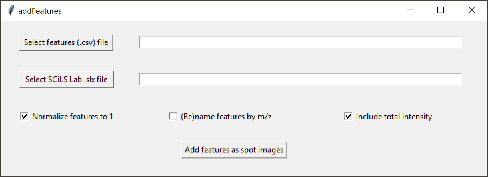

# addFeatures
addFeatures adds spot images to a SCiLS Lab dataset from a list of defined mass spectral features

[1. Introduction](#1-Introduction)  
&nbsp;&nbsp;&nbsp;&nbsp;&nbsp;[1.1 What is addFeatures?](#11-What-is-addFeatures)  
&nbsp;&nbsp;&nbsp;&nbsp;&nbsp;[1.2 What can addFeatures be used for?](#12-What-can-addFeatures-be-used-for?)  
[2. Installing addFeatures](#2-Installing-addFeatures)  
&nbsp;&nbsp;&nbsp;&nbsp;&nbsp;[2.1 Running addFeatures](#21-Running-addFeatures)  
&nbsp;&nbsp;&nbsp;&nbsp;&nbsp;[2.2 Running addFeatures from within RStudio](#22-Running-addFeatures-from-within-RStudio)  
[3. Using addFeatures](#3-Using-addFeatures)  
&nbsp;&nbsp;&nbsp;&nbsp;&nbsp;[3.1 Selecting the feature file](#31-Selecting-the-feature-file)  
&nbsp;&nbsp;&nbsp;&nbsp;&nbsp;[3.2 Selecting the SCiLS Lab dataset](#32-Selecting-the-SCiLS-Lab-dataset)  
&nbsp;&nbsp;&nbsp;&nbsp;&nbsp;[3.3 Normalization](#33-Normalization)  
&nbsp;&nbsp;&nbsp;&nbsp;&nbsp;[3.4 Renaming features](#34-Renaming-features)  
&nbsp;&nbsp;&nbsp;&nbsp;&nbsp;[3.5 Adding total intensity](#35-Adding-total-intensity)  
[4. Acknowledgements ](#4-Acknowledgements)  
[5. Further reading](#5-Further-reading)  

## 1. Introduction

### 1.1 What is addFeatures?

addFeatures adds spot images to a SCiLS Lab dataset from a list of defined mass spectral features, also generated in SCiLS Lab and saved to a CSV file.

### 1.2 What can addFeatures be used for?

addFeatures automates the otherwise tedious process of creating and naming spot images from defined regions in mass spectra, typically corresponding to one or more peaks. The spot images are written to the SCiLS Lab dataset, and are immediately available from withing SCiLS Lab. addFeatures can also normalize the intensities across the spot images to the total of all features, and create an additional image for this total intensity.

## 2. Installing addFeatures

To install addFeatures, simply download the R script and place it in an arbitrary folder, e.g. ```C:\Program Files\SCiLS Lab tools\addFeatures``` on a Windows system. Create a batch (.bat) file calling the R program with ```Rscript.exe``` for a version of R currently installed on your system that is compatible with the SCiLS Lab R API, e.g. R-4.1.2:

```
@echo off
"C:\Program Files\R\R-4.1.2\bin\Rscript.exe" "C:\Program Files\SCiLS Lab tools\addFeatures\addFeatures.R"
pause
```

If making a shortcut to this batch file, you can change its properties to run in "minimized" mode. This will automatically hide the command line interface, which is only used for debugging and troubleshooting by addFeatures.

### 2.1 Running addFeatures

To run addFeatures, simply launch the software by running the batch file or double-clicking on the shortcut. The first time addFeatures is run, any necessary R libraries will be installed. This may require manual removal of some lock files from previous R package installations.


### 2.2 Running addFeatures from within RStudio

It is also possible to run addFeatures from within RStudio. Simply launch RStudio and open the R script. Remember to use the same version of R compatible with the SCiLS Lab API. However, addFeatures is designed to be run from its graphical user interface, hiding the complexity of the R code from the user.


## 3. Using addFeatures

addFeatures has a clean graphical user interface (GUI):



Tooltips provide additional cues on the different elements of the GUI.

### 3.1 Selecting the feature file

Click on the "Select features (.csv) file button and select the CSV file defining and naming the features for which you wish to add a spot image to the SCiLS Lab dataset.

### 3.2 Selecting the SCiLS Lab dataset

Next, click on the "Select SCiLS Lab .slx file" button and navigate to the SCiLS Lab dataset (SLX file). Make sure the actual data (SBD file) is in the same directory.

### 3.3 Normalization

To express all features as a fraction of the total intensity of all features for each pixel, check the "Normalize features to 1" box. This divides the intensity for each feature in each pixel by the sum of feature intensities for the pixel.

### 3.4 Renaming features

If no names are provided in the feature (CSV) file, addFeatures will still add the features, but all names being "NA". To instead use the m/z midpoint as a name, tick the "(Re)name features by m/z" box. This will override any names provided in the CSV file.

### 3.5 Adding total intensity

To add a separate spot image containing the sum of all selected feature intensities in each pixel, check the "Include total intensity" box. This spot image is named "sum of all peaks", and can be found in the same spot image group "Peaks (normalized to 1)" as the images corresponding to individual features.


## 4. Acknowledgements

The developer wish to thank Rob Marissen for help and support during the development of addFeatures.


## 5. Further reading

addFeatures has not been described or used in any publications as yet.
